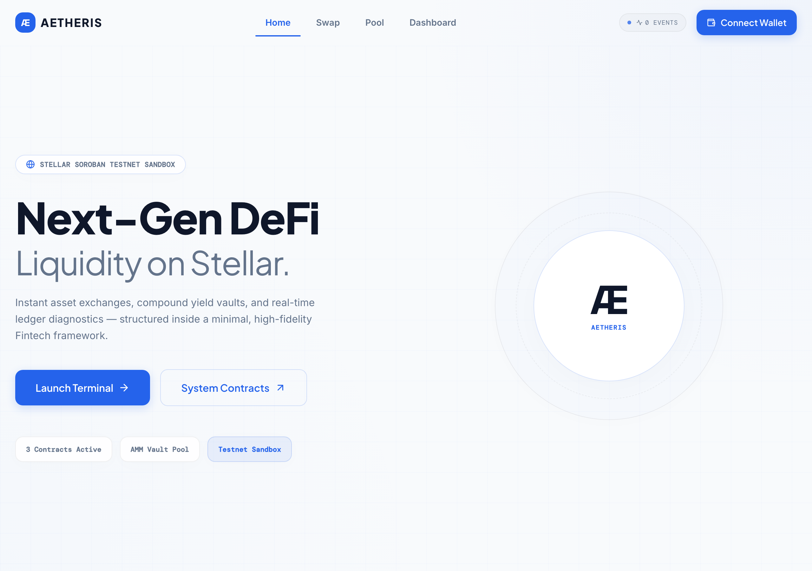
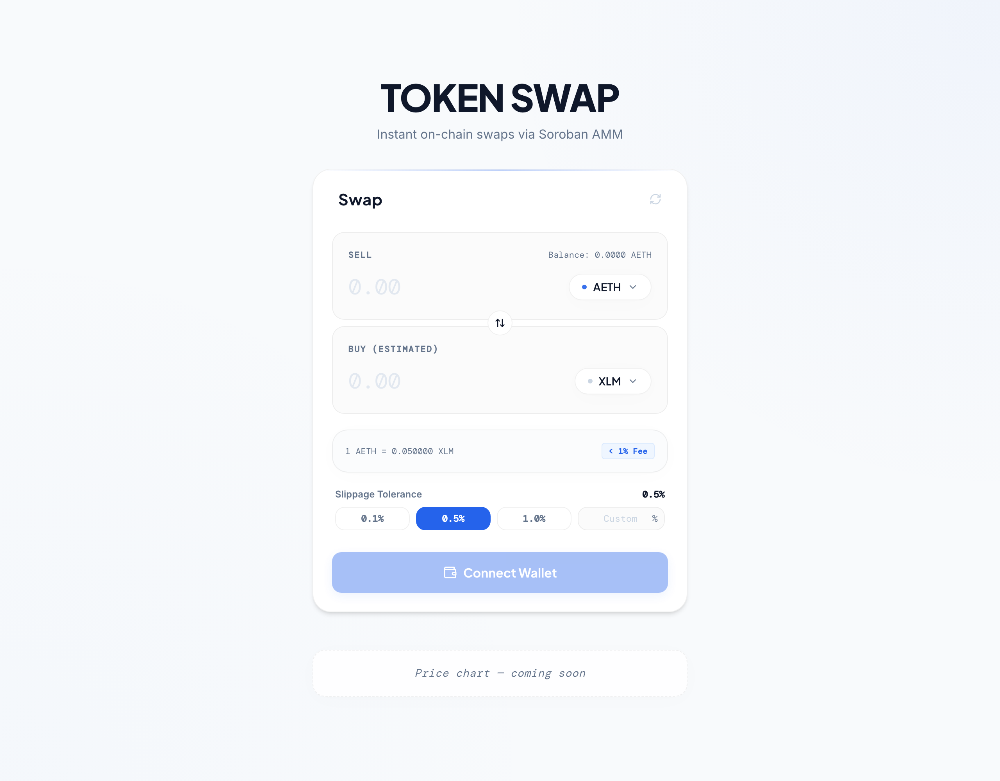
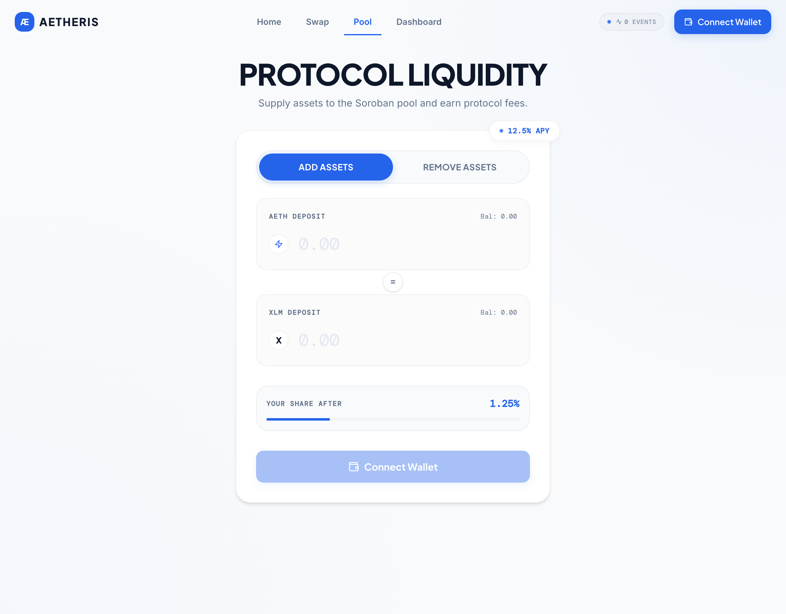
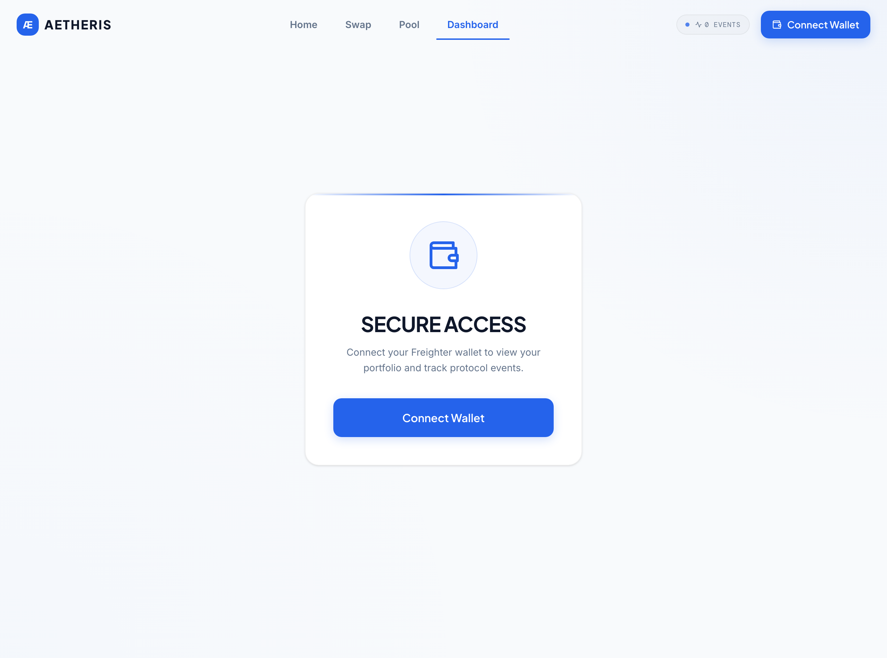
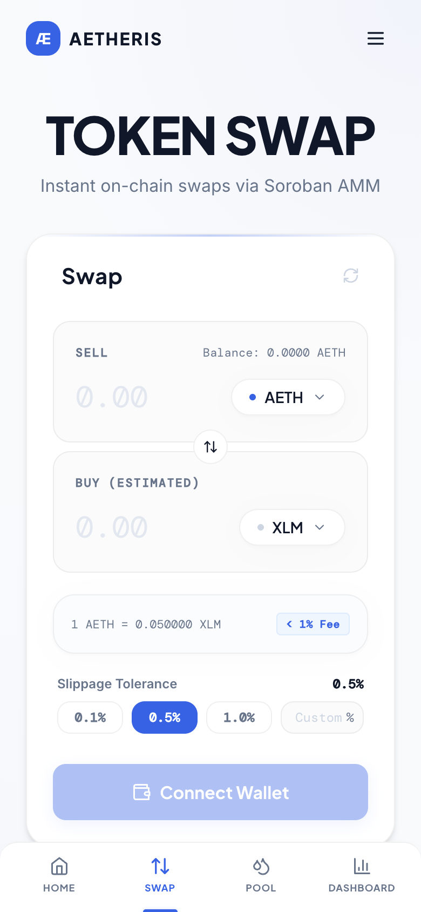

# Æ Aetheris Protocol



[](https://github.com/creed441/aetheris/actions/workflows/main.yml) &nbsp;|&nbsp; `Stellar Testnet`

> Next-generation DeFi AMM and liquidity router on Stellar Soroban. Aetheris lets users
> swap assets, provide liquidity, and watch on-chain activity update in real time, in a
> light-mode web app.

- **Live Demo:** [boisterous-boba-e7e238.netlify.app](https://boisterous-boba-e7e238.netlify.app/)
- **Demo Video:** [interactive walkthrough walkthrough](./public/screenshots/demo.gif) (embedded below)
- **Network Passphrase:** `Test SDF Network ; September 2015`
- **Soroban RPC:** `https://soroban-testnet.stellar.org`

---

## Project Description

Aetheris is an automated-market-maker (AMM) DeFi protocol on Stellar Soroban. It consists
of three on-chain contracts (a token, a constant-product AMM vault, and an operations
router) plus a Next.js frontend. Users connect a Freighter wallet, view live XLM/AETH
balances, swap between assets against the pool, provide/withdraw liquidity, and see a
real-time feed of contract events.

## Architecture

```
                    ┌─────────────────────┐
   Freighter  ─────▶│   Next.js Frontend  │  (SWR polling, 2s)
   (wallet)         │  /api/* route layer │
                    └──────────┬──────────┘
                               │ Soroban RPC / Horizon
                    ┌──────────▼──────────┐
                    │  Operations Router  │  execute_multi_hop
                    └──────────┬──────────┘
                               │ env.invoke_contract("execute_swap")
                    ┌──────────▼──────────┐
                    │      AMM Vault      │  add/remove liquidity, swap
                    └──────────┬──────────┘
                               │ env.invoke_contract("transfer")
                    ┌──────────▼──────────┐
                    │      AETH SAC       │  transfer / balance
                    └─────────────────────┘
```

## Tech Stack

- **Contracts:** Rust + `soroban-sdk` (`#![no_std]`), three workspace crates.
- **Frontend:** Next.js 14 (App Router), React 18, TypeScript, Tailwind, SWR, framer-motion.
- **Wallet:** `@stellar/freighter-api`.
- **Chain access:** `@stellar/stellar-sdk` (Soroban RPC + Horizon).
- **Tooling:** Makefile, GitHub Actions, Vitest (frontend unit tests).

## Smart Contracts (Testnet)

All three addresses resolve on Stellar Expert (verified 2026-06-27, HTTP 200, creator
`GBUM57WGJMVKTA55536KL2ELHBUN5A2R747CO2KLE7WKVGJQX3OL35AE`).

| Contract | Address | Stellar Expert |
| :--- | :--- | :--- |
| Token (AETH SAC) | `CBKASJJ5736BXR4CKZJ5U2W5QYQO5NWBPL4FJAEYVLUS2WRX3ZY22U5N` | [link](https://stellar.expert/explorer/testnet/contract/CBKASJJ5736BXR4CKZJ5U2W5QYQO5NWBPL4FJAEYVLUS2WRX3ZY22U5N) [...]
| AMM Vault | `CA2AUUHXYMHXELDP5WGSKQP3BY65IR4UG3WQEUYMSGPJGFZVPN3OSPDY` | [link](https://stellar.expert/explorer/testnet/contract/CA2AUUHXYMHXELDP5WGSKQP3BY65IR4UG3WQEUYMSGPJGFZVPN3OSPDY) |
| Operations Router | `CCQSH7LE4QAREQNMOSCKHAPK2IBIJHG4DFUWC74JPEADBZJD5WTQHXON` | [link](https://stellar.expert/explorer/testnet/contract/CCQSH7LE4QAREQNMOSCKHAPK2IBIJHG4DFUWC74JPEADBZJD5WTQHXON)[...]
| Protocol Manager (account) | `GBUM57WGJMVKTA55536KL2ELHBUN5A2R747CO2KLE7WKVGJQX3OL35AE` | [link](https://stellar.expert/explorer/testnet/account/GBUM57WGJMVKTA55536KL2ELHBUN5A2R747CO2KLE7WKVGJQX[...]

## Inter-Contract Calls

**Mechanism.** Contracts call each other on-chain via `env.invoke_contract`.

1. **AMM Vault → Token.** `fund_liquidity`, `reclaim_liquidity`, and `execute_swap` in
   [`contracts/amm-vault/src/lib.rs`](contracts/amm-vault/src/lib.rs) call
   `transfer` on the token contract:
   `env.invoke_contract::<()>(&asset, &Symbol::new(&env, "transfer"), (...).into_val(&env))`.
2. **Operations Router → AMM Vault.** `execute_multi_hop` in
   [`contracts/operations-router/src/lib.rs`](contracts/operations-router/src/lib.rs)
   calls `execute_swap` on the vault, then `transfer` on the token for a 5% fee.

**On-chain evidence (verified real):**

- **Operations Router → AMM Vault → Token multi-hop — PROVEN.**
  Tx [`50e3b67219e781933328e600a3711681251efa635e348bc5eb495b36877c8f51`](https://stellar.expert/explorer/testnet/tx/50e3b67219e781933328e600a3711681251efa635e348bc5eb495b36877c8f51)
  is a successful multi-contract call on the testnet ledger.
  The transaction effects show:
  1. The Operations Router receiving user swap parameters.
  2. The Router calling AMM Vault (`execute_swap`) to trade 10 AETH for XLM.
  3. The AMM Vault transferring `100,000,000` stroops of AETH to the vault and returning `3,999,601` stroops of XLM to the user.
  4. The Router forwarding a 5% protocol service fee in AETH to the owner account.

## Wallet Connection

- **Freighter** integration via `@stellar/freighter-api`
  ([`core/hooks/useFreighter.ts`](frontend/core/hooks/useFreighter.ts)).
- Silent session restore when the site is already trusted; explicit `requestAccess()`
  popup on connect; manual disconnect persists across reloads.
- Connected state renders a truncated address (`G…ABCD`); network is detected from the
  wallet's passphrase (TESTNET vs PUBLIC).

## Core Mechanics

Constant-product AMM (`x * y = k`):

- **Swap:** for input `dx` into reserve `x`, output `dy = y − k/(x + dx)`; reverts with
  `slippage limit exceeded` if `dy < min_amount_out`.
- **Add liquidity:** first deposit mints shares = `amount_x`; later deposits mint
  `amount_x * 100 / reserve_x` proportional shares.
- **Remove liquidity:** returns `share * reserve / total_shares` of each asset.
- **Token transfer fee:** the token applies a 1% fee routed to the vault.
- **Router fee:** `execute_multi_hop` routes a 5% fee to the owner.

## Error Handling

Explicitly handled, distinct, user-facing states (not console-only):

1. **Wallet not installed** — "Freighter extension is not installed. Get it at freighter.app".
2. **Signature rejected / connection denied** — "Connection rejected…" / "Signing failed
   or rejected by user", with loaders reset (no crash).
3. **Insufficient balance** — pre-flight check in `SwapCard` blocks the swap with a
   distinct message before any network broadcast.
4. **Generic submission failure** — surfaced in an on-screen banner via `safeStellarCall`
   error normalization.

Loading/pending states are shown during simulation and submission
`Idle → Simulating → Requesting Signature → Submitting → Confirmed`.

## Screenshots

> The previous design templates were removed. The images below are **real screenshots of this app**,
> captured from the running dev server on 2026-06-27.

### Interactive Demo Walkthrough


### Core swap flow (desktop)


### Liquidity pool


### Dashboard — wallet connection screen


### Mobile UI (390px width)


### CI/CD Pipeline Status


Real-time CI/CD pipeline execution showing automated build, test, and deployment workflows running on GitHub Actions.

### Contract Test Output


Full contract test suite output demonstrating all 17 unit tests passing across token, AMM vault, and operations router modules.

### Verification Evidence Status
| Evidence | Status | Location / Reference |
| :--- | :--- | :--- |
| CI/CD Pipeline Runs | **PASSING** | [GitHub Actions Status](https://github.com/creed441/aetheris/actions) |
| Contract Unit Tests | **PASSING** (17 tests) | [`docs/test-output.txt`](docs/test-output.txt) |
| On-Chain Multi-Contract Invocation | **PROVEN** | [Stellar Expert Tx](https://stellar.expert/explorer/testnet/tx/50e3b67219e781933328e600a3711681251efa635e348bc5eb495b36877c8f51) |

## Setup Instructions

Requires Rust + `cargo`, the `wasm32-unknown-unknown` target, and Node.js 20+.

```bash
# 1. Install deps
npm install
cd frontend && npm install && cd ..

# 2. Run contract tests
make test

# 3. Build optimized WASM
make build-contracts

# 4. Deploy + initialize (needs real testnet secret keys)
STELLAR_ISSUER_SECRET=S... STELLAR_DISTRIBUTOR_SECRET=S... make deploy

# 5. Configure the frontend
cp frontend/.env.example frontend/.env.local   # fill in contract addresses from step 4

# 6. Run the dev server
cd frontend && npm run dev
```

## Testing

**Contracts** — `make test` (i.e. `cargo test --all`). Latest real run: **17 passed, 0
failed** (raw output committed at [`docs/test-output.txt`](docs/test-output.txt)):

```
aether_token       8 passed
amm_vault          6 passed
operations_router  3 passed
```

**Frontend** — pure swap/format logic is unit-tested with Vitest:

```bash
cd frontend && npm test
```

## Roadmap & Future Extensions

- **Multi-Asset Pool Support:** Generalize the AMM Vault to support arbitrary token pair pools beyond the core AETH/XLM trading pair.
- **Production Issuer Key Management:** Transition the testnet admin faucet issuer keys to a multi-signature custody setup (e.g., using Stellar's native threshold signature configurations).
- **Frontend Optimization:** Enable server-side rendering support for active ledger events feed on the dashboard page.

## License

Released under the [MIT License](LICENSE).
